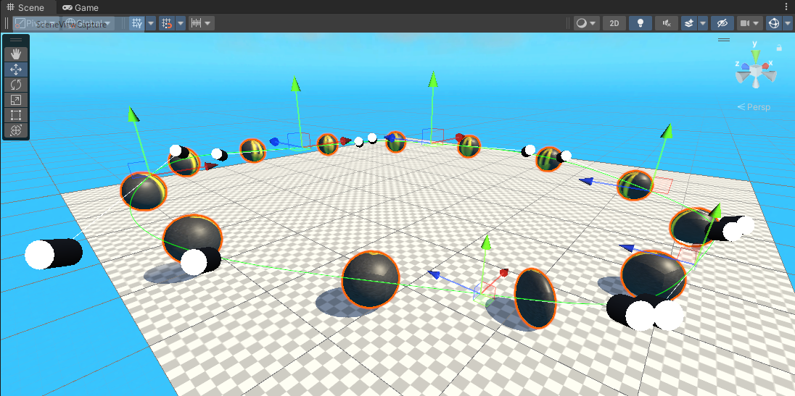
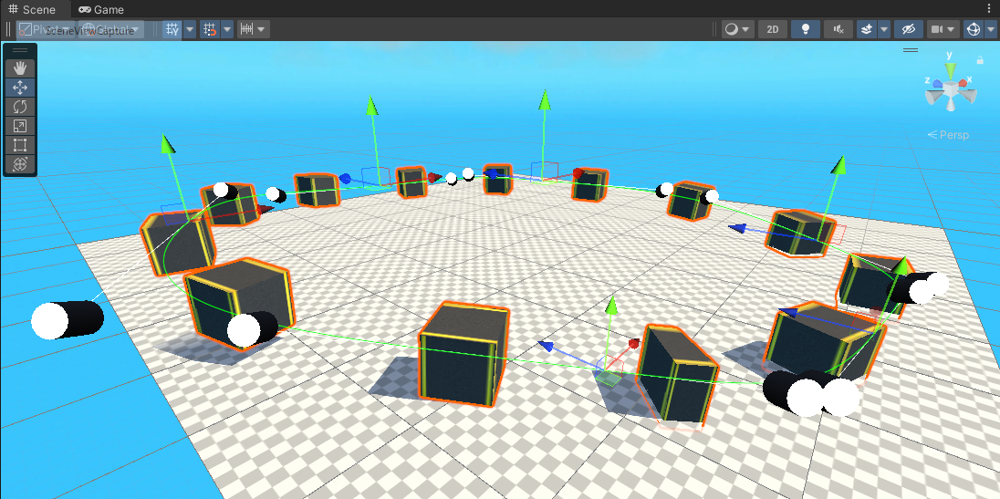
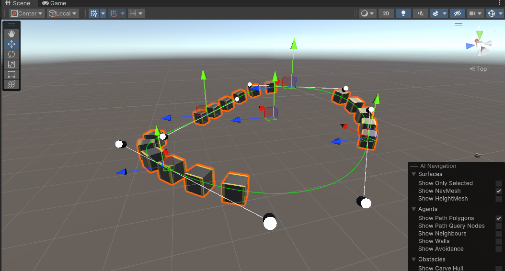
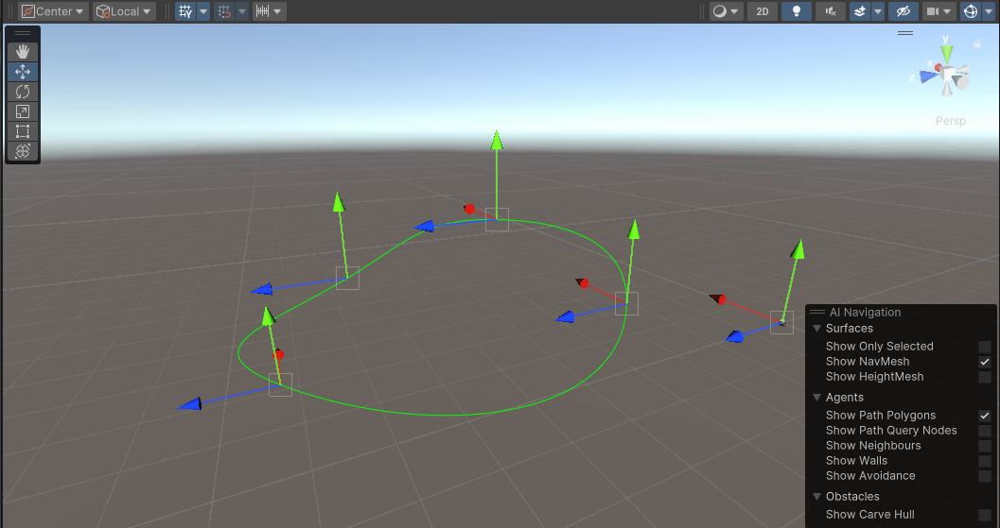
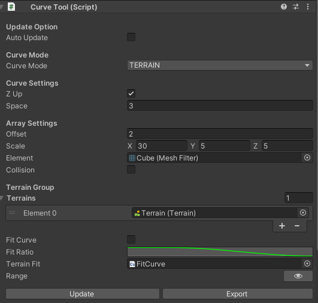

# TLabCurveTool
This is a utility tool for Unity that allows you to place objects in a sequence like Blender's curves.  
It can also be used as a simple curve.  
[I made it based on this tutorial.](https://www.youtube.com/playlist?list=PLFt_AvWsXl0d8aDaovNztYf6iTChHzrHP)

## Screenshot  
Placement along the curve of Sphere  

Sequential placement of arbitrary meshes (Textured cubes)  

Duplicate an object by specifying a range  

Use as a simple curve  

## Operating Environment
- Unity: 2022.3.3f1 --> 2022.3.11f1  

### Installing
Clone the repository or place the downloaded package under any Unity project

### How To Use
Create an arbitrary game object and attach this script to it  

| Key | Action |
| --- | --- |
| A | Add segment |
| D | Deletion of segment |
| S | Insert segment |

### TODO
- Intersection generation
- Fit terrain height map to path

### Reference
- [Sebastian Lague](https://www.youtube.com/playlist?list=PLFt_AvWsXl0d8aDaovNztYf6iTChHzrHP)
- [Road Texture](https://www.freepik.com/free-photo/lines-traffic-paved-roads-background_3738059.htm)
