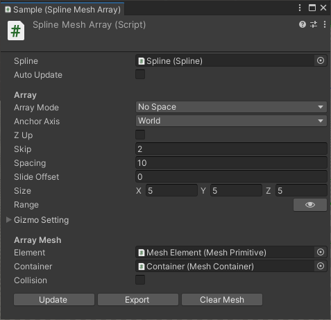
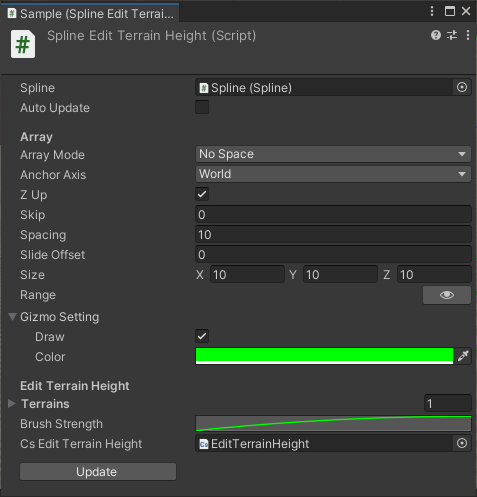
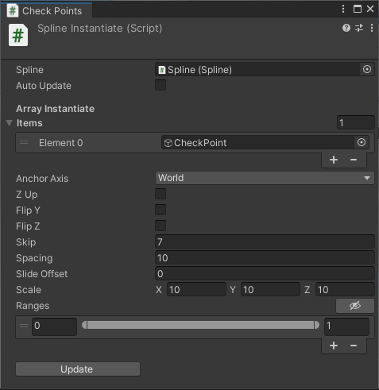

# TLab-Spline
Spline tool for unity.  
[I made it based on this tutorial.](https://www.youtube.com/playlist?list=PLFt_AvWsXl0d8aDaovNztYf6iTChHzrHP)

## Feature  
- Instantiate Mesh / GameObject and place it along the spline
- Edit terrain height along to spline curve
- Apply GameObject's Transform to Curve
- Angle offset for each anchor point
- Specify the effective range of the curve (-1 ~ 1)
- Multi range for one curve
- Curve Primitive with custom divisions (Line, Circle, Polygon)

</img>

<video src="https://github.com/user-attachments/assets/72c5b4cd-9df2-45ba-9a7f-e09f46817fec"></video>

<details><summary>components</summary>

</img>

</img>

</img>

</img>

</details>

## Development Environment
- Unity: 2022.3.11f1 (URP)  

### Install

### Git
Clone this repository with the following command

```
git clone https://github.com/TLabAltoh/TLab-Spline.git
```

or

```
git submodule add https://github.com/TLabAltoh/TLab-Spline.git
```

### Unity Package Manager
add package from git URL ...

```
https://github.com/TLabAltoh/TLab-Spline.git#upm
```

### How to Edit Spline

| Key | Action |
| --- | --- |
| A | Add segment |
| D | Deletion of segment |
| S | Insert segment |

### TODO
- support Undo for editor gui's button action.

### Reference
#### Source Code
- [youtube](https://www.youtube.com/playlist?list=PLFt_AvWsXl0d8aDaovNztYf6iTChHzrHP)
- [Path Creator](https://github.com/SebLague/Path-Creator/tree/master)
#### Assets
- [sample's texture](https://www.freepik.com/free-photo/lines-traffic-paved-roads-background_3738059.html)
